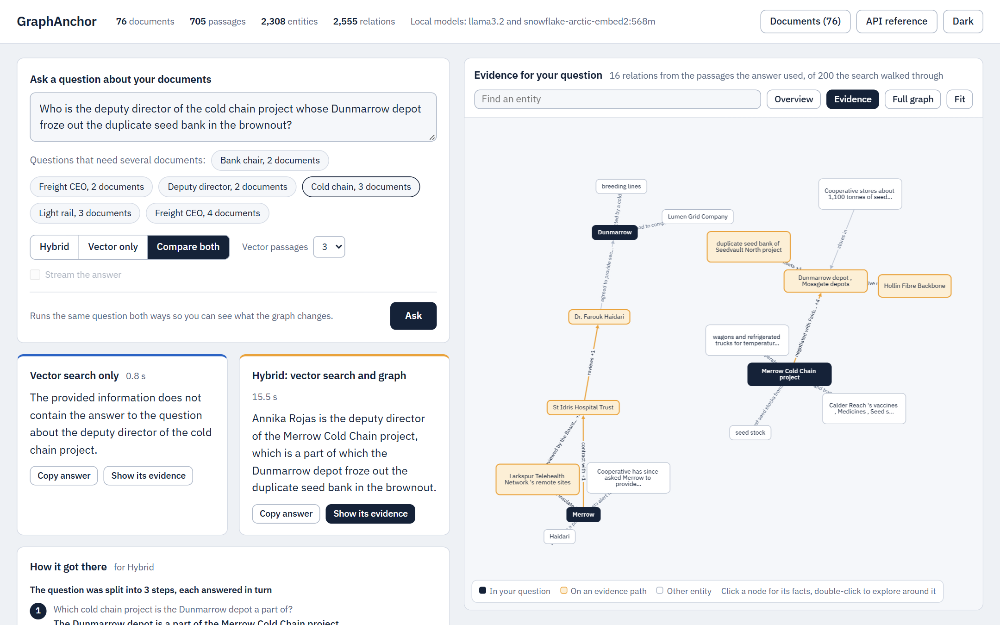
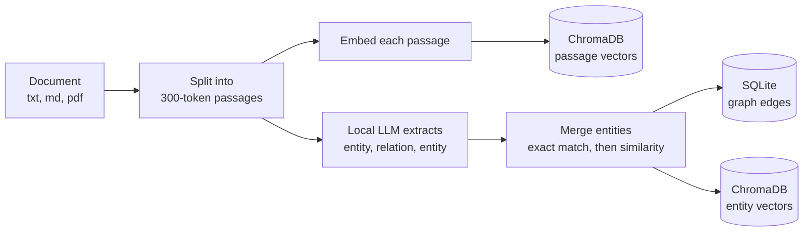
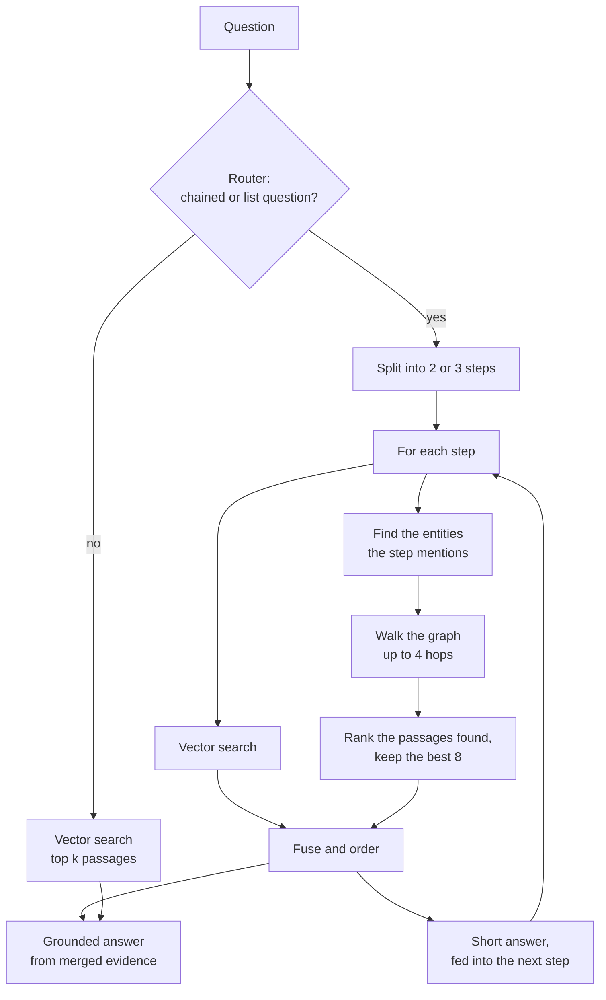
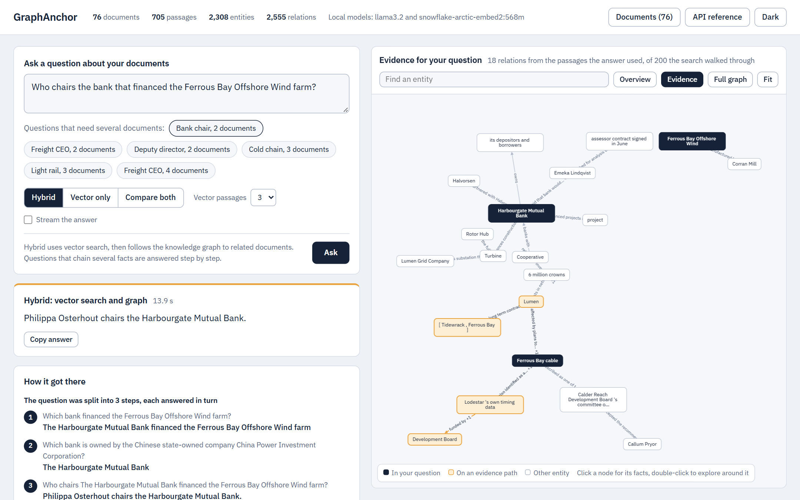
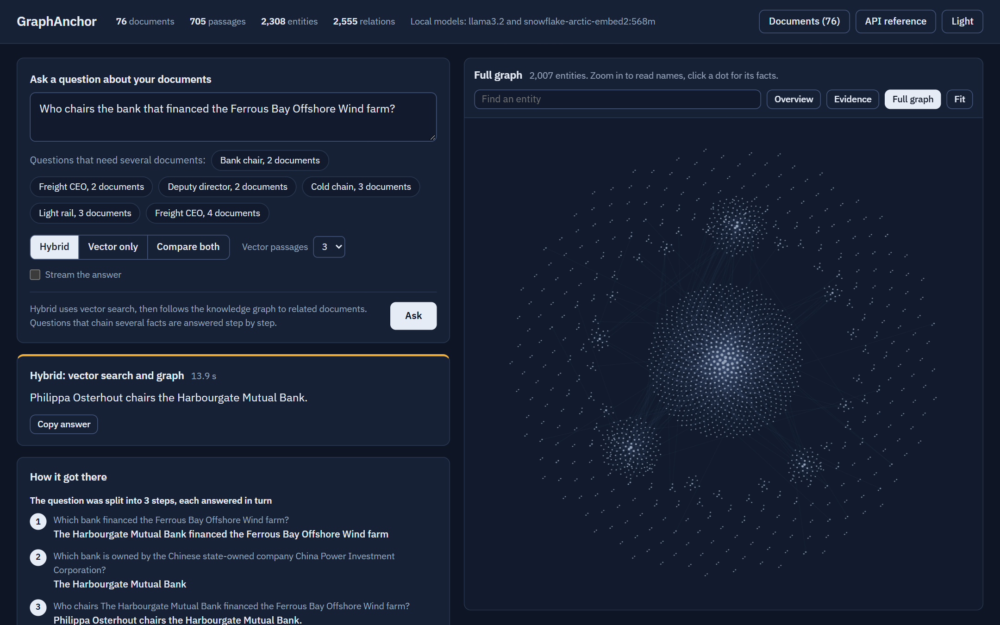

# GraphAnchor

**Local-first hybrid RAG: vector search plus a knowledge graph, with step-by-step reasoning for questions that span several documents.**


-black)


GraphAnchor answers questions about your own documents. It runs entirely on your machine through
[Ollama](https://ollama.com/): no API keys, no data leaves the computer, and it works with a 3B model on a laptop.

Standard RAG finds passages that *look like* the question. That fails when the answer needs facts from several
documents that do not resemble the question at all. GraphAnchor builds a knowledge graph while it ingests, then follows
relations from one document to the next to fetch the passages vector search cannot see.



## Contents

- [Why it exists](#why-it-exists)
- [Questions that show the difference](#questions-that-show-the-difference)
- [Results](#results)
- [How it works](#how-it-works)
- [Quick start](#quick-start)
- [Using the web interface](#using-the-web-interface)
- [API](#api)
- [Configuration](#configuration)
- [Protecting your data](#protecting-your-data)
- [Benchmark](#benchmark)
- [Tests](#tests)
- [Project layout](#project-layout)
- [Limitations](#limitations)
- [Roadmap](#roadmap)

## Why it exists

Take this question from the benchmark:

> Who chairs the bank that financed the Ferrous Bay Offshore Wind farm?

The wind farm's document names the bank. The bank's own document names its chair. No single passage holds both facts.

| | Answer | Correct |
|---|---|---|
| Vector RAG | "The Harbourgate Mutual Bank chairs the bank that financed the Ferrous Bay Offshore Wind farm." | No |
| GraphAnchor | "Philippa Osterhout chairs the Harbourgate Mutual Bank, which financed the Ferrous Bay Offshore Wind farm." | Yes |

Vector search retrieved passages about the wind farm, because those match the question's words. The passage naming
the chair never mentions a wind farm, so it was never retrieved. GraphAnchor found the bank in the graph, followed its
relations to the bank's document, and answered in three steps:

1. Which bank financed the Ferrous Bay Offshore Wind farm? *The Harbourgate Mutual Bank.*
2. Who chairs the Harbourgate Mutual Bank? *Philippa Osterhout.*
3. The original question, answered from the merged evidence.

## Questions that show the difference

Twelve benchmark questions where standard vector RAG fails and GraphAnchor answers correctly. Each was re-run on the
final system: GraphAnchor answered correctly in **4 of 4** runs and vector RAG in **0 of 2**. The last two columns count
how many of the documents a question needs were among the retrieved passages.

| # | Question | Vector RAG answered | GraphAnchor answered | Documents found: vector / GraphAnchor |
|---|---|---|---|---|
| 117 | Who chairs the bank that financed the Ferrous Bay Offshore Wind farm? | names the bank as the chair | Philippa Osterhout | 1 of 2 / **2 of 2** |
| 132 | Who chairs the bank that financed the port project whose biggest customer is Strand & Keel Shipping? | "chairman not explicitly stated" | Philippa Osterhout | 1 of 2 / **2 of 2** |
| 122 | Who is the chief executive of the freight company that carries the isotopes made at Isotope Works? | names the wrong company, "not stated" | Ravindra Kallenbach | 1 of 2 / **2 of 2** |
| 125 | Who is the chief executive of the group that supplied the membranes for the Wetmoor Water Reuse plant? | names the project director | Sigrid Tavares | 1 of 2 / **2 of 2** |
| 119 | Who is the chief executive of the company that buys the electricity produced by the Tidewrack Tidal Array? | "does not contain the answer" | Anselm Rask | 1 of 2 / **2 of 2** |
| 201 | Who is the deputy director of the project led by the former Harbourgate Mutual Bank infrastructure analyst? | names the director, not the deputy | Wilhelmina Odhiambo | 0 of 2 / **1 of 2** |
| 209 | Who is the refrigeration chief of the cold chain project that the hospital trust jointly sponsors with the Development Board? | names the director | Cosmo Bhatt | 1 of 2 / **2 of 2** |
| 212 | Who heads the polymer laboratory at the plant that made the Wetmoor membrane modules? | names the plant manager | Dr. Fatima Ashworth | 0 of 2 / **2 of 2** |
| 223 | Who is the network chief of the fibre network whose trunk cable a dredging barge severed in June 2023? | "cannot be answered" | Ngozi Valera | 1 of 2 / **2 of 2** |
| 231 | Who is the deputy director of the cold chain project whose Dunmarrow depot froze out the duplicate seed bank in the brownout? | "does not contain the answer" | Annika Rojas | 2 of 3 / **3 of 3** |
| 234 | Who is the signals chief of the light rail project that suffered fail-safe stops when the timing signal from Cairn Head degraded? | "not explicitly stated" | Pavel Lindgren | 2 of 3 / **3 of 3** |
| 162 | Who is the chief executive of the freight company whose largest customer is the port project directed by a former employee of the bank that financed the Tidewrack array? | "not explicitly stated" | Ravindra Kallenbach | 1 of 4 / **2 of 4** |

These were chosen because GraphAnchor wins them, so they show what the graph adds; they are not a fair sample. For the
fair numbers, see [Results](#results). The web interface offers six of them as one-click examples, and the number is
the question's id in [benchmark/gold_qa.json](benchmark/gold_qa.json).

## Results

Same local models, same ingested corpus, same questions. Vector RAG gets the 3 most similar passages; GraphAnchor gets
the same 3 plus up to 8 found through the graph. Full method, every table and the limitations are in
[results.md](results.md).

### Headline

| Questions | n | Metric | Vector RAG | GraphAnchor | Difference |
|---|---|---|---|---|---|
| **Multi-hop** (2, 3 and 4+ documents) | 79 | Answers correct | 38.0% | **59.5%** | **+21.5 pts** |
| | | Right documents retrieved | 51.9% | **88.3%** | **+36.4 pts** |
| **Single-fact** (control) | 59 | Answers correct | 89.0% | **90.7%** | +1.7 pts |
| | | Right documents retrieved | 93.2% | 93.2% | 0.0 |
| **All reported questions** | 138 | Answers correct | 59.8% | **72.8%** | **+13.0 pts** |
| | | Right documents retrieved | 69.6% | **90.4%** | **+20.8 pts** |

Question by question, GraphAnchor was better on 25, the same on 106 and worse on 7 (sign test p = 0.002). On the
single-fact control group it never lost.

### By number of documents the answer needs

| Category | n | Answers: vector | Answers: GraphAnchor | Documents: vector | Documents: GraphAnchor |
|---|---|---|---|---|---|
| Two-hop | 46 | 43.5% | **63.0%** | 58.7% | **95.7%** |
| Three-hop | 23 | 39.1% | **69.6%** | 49.3% | **79.7%** |
| Four-hop or more | 10 | 10.0% | **20.0%** | 26.8% | **74.5%** |
| Single-fact (control) | 59 | 89.0% | **90.7%** | 93.2% | 93.2% |

### Speed

| | Vector RAG | GraphAnchor |
|---|---|---|
| Retrieval only (no model call), mean | 0.08 s | 0.21 s |
| Full answer, single-fact question, median | 0.8 s | 0.6 s |
| Full answer, multi-hop question, median | 0.9 s | 12.3 s |

Walking the graph costs about 0.13 s. The extra time on multi-hop questions is the step-by-step answering, which makes
several model calls. Single-fact questions skip the graph, so they cost the same as vector RAG.

### What these numbers do not show

- They come from **one run** on a **synthetic corpus** written to need several documents. Between near-identical runs
  the multi-hop score moved by about 8 points, so read the multi-hop gap as roughly +14 to +29 points. The retrieval
  gap is deterministic.
- GraphAnchor uses more context and more model calls than the baseline. A vector baseline given the same number of
  passages was not measured.
- 10 list-style ("which projects...") questions are excluded from the tables. GraphAnchor scored **below** vector RAG on
  them (54.8% against 64.7%).
- No comparison with other graph RAG systems was run. The claim here is only against standard vector RAG.

## How it works

### Ingestion



1. **Split.** Text is cut into 300-token passages with a 50-token overlap.
2. **Embed.** Each passage is embedded with `snowflake-arctic-embed2` and stored in ChromaDB.
3. **Extract.** The local LLM reads each passage and returns `(entity, relation, entity)` triples as schema-constrained
   JSON, with pronouns resolved to names.
4. **Merge entities.** A new entity name is cleaned with spaCy, matched exactly against known entities, then by
   embedding similarity (threshold 0.7), so "Dr. Ines Varga" and "Ines Varga" become one node.
5. **Store.** Triples go to SQLite, each linked to the passage it came from. That link is what lets a graph walk return
   text, not just names.

Ingestion is incremental (one document at a time, no global rebuild), atomic (a failure commits nothing) and
de-duplicated by content hash.

### Answering



1. **Route.** Wording cues decide whether a question chains facts ("the bank *that financed* the farm *whose*...") or
   asks for a list. Single-fact questions skip the graph entirely, so extra passages cannot dilute an answer vector
   search already has.
2. **Anchor.** Entities named in the question are located in the graph by exact phrase, by their distinctive
   proper-noun words, and by embedding similarity.
3. **Walk.** A breadth-first walk follows relations out from the anchors for up to 4 hops and collects the passages
   those relations were extracted from.
4. **Select.** The walk touches far more passages than a small model can read. Candidates are ranked by embedding
   similarity blended with IDF-weighted overlap with the question's rarer words, with a discount for documents already
   chosen, and the best 8 are kept. This step alone raised three-hop document retrieval from 73.9% to 84.1%.
5. **Decompose.** A multi-hop question is split into 2 or 3 sub-questions. Each is retrieved and answered briefly, and
   each short answer is substituted into the next sub-question.
6. **Answer.** A strict prompt answers only from the supplied passages, names the exact role asked for, and replies
   "The provided information does not contain the answer" instead of guessing.

Every response includes the passages used, where each came from (vector, graph, or both), the reasoning steps and the
chains of relations that connected the documents.

## Quick start

### Requirements

- Python 3.11 or newer
- [uv](https://docs.astral.sh/uv/)
- [Ollama](https://ollama.com/)
- About 4 GB of disk for the two models

### Install and run

```bash
git clone https://github.com/Lohithnath2910/GraphAnchor.git
cd GraphAnchor

ollama pull llama3.2
ollama pull snowflake-arctic-embed2:568m

uv sync                                              # installs everything, including the pinned spaCy model
uv run uvicorn main:app --host 127.0.0.1 --port 8000
```

Open <http://127.0.0.1:8000>. The API reference is at <http://127.0.0.1:8000/docs>.

On Windows, use `127.0.0.1` rather than `localhost`: `localhost` added about 2 s to every request on the development
machine because of IPv6 fallback.

### Docker

```bash
docker compose up --build
```

This starts Ollama, downloads both models on first run (several GB), then starts the API on port 8000. The graph
database, vector store and embedding cache live in `./data` and survive restarts. For an NVIDIA GPU, uncomment the
`deploy` block in [docker-compose.yml](docker-compose.yml).

### Add documents

Use the **Documents** button in the web interface, or the API:

```bash
curl -F "file=@notes.pdf" http://127.0.0.1:8000/ingest
```

To load the benchmark corpus into an empty database (76 documents, roughly 3 to 6 hours on a laptop, because every
passage is read by the model):

```bash
uv run python benchmark/ingest.py
```

## Using the web interface

A single page served by the API, with no build step and no external requests, so it works offline.



**Left: ask and read.**

- **Hybrid**, **Vector only**, or **Compare both**. Compare runs the same question both ways, side by side, each with
  its own timing.
- **How it got there** shows the steps a multi-hop question was split into, and the chains of relations that linked
  the documents.
- **Passages** lists exactly what the model read. Blue passages came from vector search; marigold passages were added
  by the graph.
- **Stream the answer** prints it word by word. A streamed answer is written in one pass without step-by-step reasoning, so it can be less accurate on multi-document questions; leave it off for those.

**Right: the knowledge graph.** Drawing every entity at once is unreadable, so the panel shows focused views:

| View | Shows |
|---|---|
| Overview | the most connected entities and their closest neighbours |
| Evidence | after a hybrid question: the entities the question mentions (filled), the chains that linked the documents (marigold) and the relations extracted from the passages used |
| Around an entity | search for any entity, or double-click a node, to see its neighbourhood |
| Full graph | every entity as a dot, clustered around its best-connected neighbour; zoom in to read names |

Click any node or relation to see the underlying facts and the file each came from.



## API

| Endpoint | Purpose |
|---|---|
| `POST /ingest` | upload a `.txt`, `.md` or `.pdf` file (multipart field `file`) |
| `GET /query` | retrieval plus answer, with full evidence |
| `GET /answer`, `POST /answer` | the answer text only |
| `GET /answer/stream`, `POST /answer/stream` | the answer as server-sent events |
| `GET /documents` | list ingested documents with passage and relation counts |
| `GET /documents/{id}` | one document's passages and relations |
| `GET /graph/stats` | counts, model names, and whether deleting is enabled |
| `GET /graph/all` | every node and relation |
| `DELETE /documents/{id}` | delete one document (disabled by default, see [below](#protecting-your-data)) |
| `DELETE /reset?confirm=true` | delete everything (disabled by default) |

### `GET /query`

| Parameter | Default | Meaning |
|---|---|---|
| `q` | required | the question |
| `k` | 3 | passages from vector search (1 to 20) |
| `enable_graph` | `true` | `false` gives plain vector RAG |
| `answer` | `true` | `false` returns retrieval only, with no model call |
| `decompose` | from config | force step-by-step answering on or off |

```bash
curl "http://127.0.0.1:8000/query?q=Who%20chairs%20the%20bank%20that%20financed%20the%20Ferrous%20Bay%20Offshore%20Wind%20farm%3F"
```

```jsonc
{
  "query": "Who chairs the bank that financed the Ferrous Bay Offshore Wind farm?",
  "answer": "Philippa Osterhout chairs the Harbourgate Mutual Bank, which financed the Ferrous Bay Offshore Wind farm.",
  "reasoning_steps": [                       // present when the question was split into steps
    { "question": "Which bank financed the Ferrous Bay Offshore Wind farm?", "answer": "The Harbourgate Mutual Bank ..." }
  ],
  "ranking_breakdown": [                     // the passages the answer was written from, best first
    { "chunk_id": "...", "text": "...", "source_type": "vector | graph | hybrid",
      "composite_score": 0.61, "metadata": { "filename": "32_harbourgate_mutual_bank.txt" } }
  ],
  "graph_traversal": {
    "metadata": { "anchor_entities": ["Harbourgate Mutual Bank"], "edge_count": 198 },
    "edges": [ { "source": "...", "relation": "...", "target": "...", "confidence": 1.0, "found_in_chunk": "..." } ],
    "paths": [ "A -[relation]-> B ; B -[relation]-> C  (evidence in file.txt)" ]
  },
  "vector_search_results": [ ... ]
}
```

## Configuration

[config.yaml](config.yaml) holds models, paths and chunking. Behaviour switches have defaults in
[src/config.py](src/config.py) and can be overridden by adding the key to `config.yaml`.

| Setting | Default | Meaning |
|---|---|---|
| `llm_model` | `llama3.2` | Ollama model for extraction and answers |
| `embed_model` | `snowflake-arctic-embed2:568m` | Ollama embedding model |
| `db_path`, `chroma_path` | `./data/graph.db`, `./data/chroma` | where the graph and vectors are stored |
| `chunk_size`, `chunk_overlap` | 300, 50 | passage size and overlap, in tokens |
| `similarity_threshold` | 0.7 | how similar two entity names must be to merge |
| `max_file_size_mb` | 5 | upload limit |
| `extraction_max_relations` | 20 | relations extracted per passage |
| `graph_routing` | on | single-fact questions skip the graph |
| `decompose_multihop` | on | answer multi-hop questions in steps |
| `decompose_max_steps` | 3 | most steps a question is split into |
| `prompt_v2` | on | the stricter, grounded answer prompt |
| `graph_lexical_weight` | 0.5 | share of graph passage selection from question-word overlap |
| `graph_same_doc_discount` | 0.6 | penalty per passage already chosen from the same document |
| `graph_hygiene`, `graph_min_coverage_gain` | off | experiments that were measured and not adopted |

Environment variables:

| Variable | Meaning |
|---|---|
| `OLLAMA_HOST` | address of a remote Ollama (the Docker setup sets this) |
| `GRAPHANCHOR_ALLOW_DELETE` | set to `1` to enable the delete endpoints |

Changing the embedding model or chunking after ingesting means ingesting again.

## Protecting your data

Building the graph is the expensive part: the benchmark corpus takes hours to ingest. So nothing can delete data unless
you opt in.

- `DELETE /reset` and `DELETE /documents/{id}` return **403** by default.
- The web interface shows no delete controls by default.
- To enable both, start the server with `GRAPHANCHOR_ALLOW_DELETE=1`. The Documents dialog then shows a Delete button
  per document.

```bash
GRAPHANCHOR_ALLOW_DELETE=1 uv run uvicorn main:app --port 8000        # bash
$env:GRAPHANCHOR_ALLOW_DELETE = "1"; uv run uvicorn main:app --port 8000   # PowerShell
```

Everything lives in `./data` (not tracked by git). To back up, stop the server and copy that folder.

## Benchmark

[benchmark/](benchmark/) holds the 76-document corpus (30 real course documents and 46 synthetic "Calder Reach"
documents) and 148 questions with expected answers and the documents each one needs. See
[benchmark/README.md](benchmark/README.md) for how the questions were built.

```bash
# both modes, all questions (about 40 minutes)
uv run python eval/run_benchmark.py --out eval/results/my_run.csv

# retrieval only, no language model (a few minutes)
uv run python eval/run_benchmark.py --out eval/results/my_retrieval.csv --retrieval-only
```

The runner refuses to overwrite an existing results file unless `--resume` is passed. Every run behind
[results.md](results.md) is recorded in [eval/results/](eval/results/).

## Tests

```bash
uv run pytest
```

The tests mock the models and run against a throwaway database in a temporary directory. They never touch `./data`.

## Project layout

| Path | Contents |
|---|---|
| `main.py` | API server: ingestion, routing, graph walk, passage selection, multi-step answering |
| `src/` | configuration, storage (SQLite and ChromaDB), embeddings, chunking, prompts and generation |
| `web/` | the web interface: one HTML file, plus a vendored graph library and fonts |
| `config.yaml` | models, paths and chunking |
| `benchmark/` | corpus, questions, question builder, ingestion script |
| `eval/` | benchmark runner and every recorded result |
| `tests/` | API tests |
| `docs/` | project report, codebase explanation, screenshots |
| `results.md` | the full evaluation report |
| `data/` | your graph database, vector store and embedding cache (created on first run, not tracked) |

## Limitations

- **Multi-hop answers are slow**: about 12 s against under 1 s, because each is answered in several model calls.
- **A 3B model is noisy.** The same multi-hop question can be answered correctly on one run and wrongly on the next.
- **List questions are a weak spot.** GraphAnchor trails vector RAG on "which projects..." style questions.
- **Four-hop questions remain hard**: 20% correct, against 10% for vector RAG.
- **Graph quality is limited by the extraction model.** 43% of stored relation phrases are longer than four words, and
  64% of entities have a single relation.
- **The router and selection weights were tuned on the benchmark questions**, so the benchmark is not a held-out test.
- **Ingestion is slow**, because every passage is read by the model.

## Roadmap

1. Better handling of list and aggregation questions.
2. Cheaper multi-hop answers: run independent steps in parallel and cache step results.
3. A cleaner graph: a closed relation vocabulary and stronger entity canonicalisation.
4. A lightweight reranker over the merged passages.
5. Stronger evidence: repeated runs with confidence intervals, a matched-passage vector baseline, and a held-out
   question set.
6. Evaluation on larger, real-world corpora.

## Acknowledgements

Built with [FastAPI](https://fastapi.tiangolo.com/), [Ollama](https://ollama.com/),
[ChromaDB](https://www.trychroma.com/), [spaCy](https://spacy.io/) and [Cytoscape.js](https://js.cytoscape.org/).
The interface is set in [IBM Plex](https://www.ibm.com/plex/).

## License

No license file has been added yet, so default copyright applies. Add a `LICENSE` file before others reuse the code.
